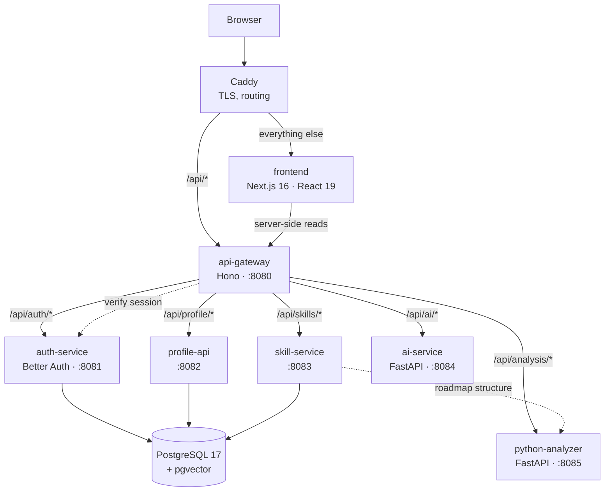
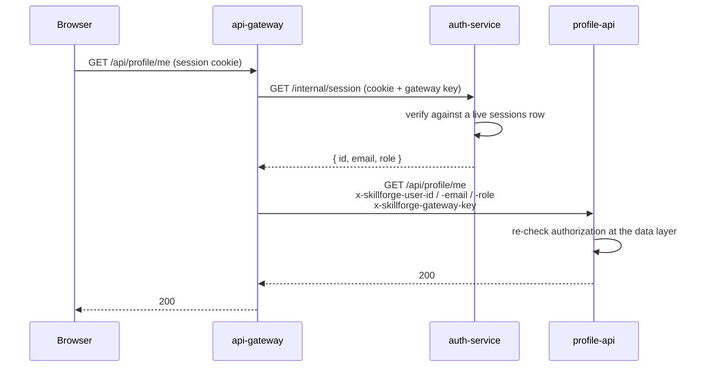

# Architecture

Service names match the diagram in the requirements PDF exactly.

## The system

All five services are built and running. `skill-service` still falls back to a
local TypeScript layering for the roadmap if `python-analyzer` is unreachable
(see "Duplicated logic" in `docs/decisions.md`) — that fallback is a
resilience choice now, not a stand-in for an unbuilt service.

`ai-service` and `python-analyzer` hold no `DATABASE_URL` and never touch
Postgres. Both are stateless HTTP services: the Node tier assembles a
student's data through Drizzle and sends it in the request body; the Python
tier computes or generates over that payload and hands a response straight
back. Nothing downstream of `GW -->|"/api/ai/*"| AI` or
`GW -->|"/api/analysis/*"| PY` reaches the database.

## Request path

Every request from the browser is same-origin. Caddy splits `/api/*` to the
gateway and everything else to Next. In local development there is no Caddy, so
`next.config.ts` rewrites `/api/*` to the gateway instead — same shape, one less
container.

That sameness is not cosmetic. A cross-origin gateway would need `SameSite=None`
cookies, which need TLS, which would make a plain `docker compose up` unable to
sign anyone in.

## Identity

Three rules hold this together:

1. **The session is verified once**, at the gateway, against a database row —
   not a JWT signature. Signing a student out actually signs them out.
2. **Identity travels as headers**, and the gateway strips any the client sent
   before adding its own. A forged `x-skillforge-user-id` never survives the hop.
3. **Services trust those headers only with the gateway key.** A request that
   reaches a service directly carries no identity; one carrying a wrong key is
   rejected outright. Reachability is not the only thing standing between a
   stray container and another student's profile.

Authorization is re-checked where the data lives. A mentor reading a student's
profile is a join against `mentorships` — holding the role grants nothing on its
own.

## Why a gateway at all

The frontend knows five path prefixes and no hostnames. Adding `ai-service` is a
line in the gateway's route table and a compose block; nothing in the UI changes.

The gateway holds no `DATABASE_URL`. A router with database credentials is a
router that will eventually start querying.

## Data ownership

| Service | Tables it writes |
|---|---|
| `auth-service` | `users`, `sessions`, `accounts`, `verifications`, `rate_limits` |
| `profile-api` | `profiles`, `student_skills`, `projects`, `project_skills`, `certifications`, `uploads` |
| `skill-service` | `attempts`, `attempt_answers`, `skill_state`, `reviews`, `roadmaps`, `roadmap_phases`, `roadmap_phase_skills` |
| seed script | `skills`, `skill_prerequisites`, `target_roles`, `role_requirements`, `resources`, `assessments`, `questions` |

One database, one migration history in `packages/db`. Separate databases per
service would mean the gap calculation — a join between `student_skills` and
`role_requirements` — becomes an HTTP call and a loop.

## Deployment

`docker-compose.yml` is both local development and production, deployed with
Coolify on a Contabo VPS. `kubernetes/` describes the same system for a cluster
— every service in the compose file has a `Deployment`, ai-service on one
replica because each replica embeds the corpus at boot and shares nothing with
the others. `terraform/` provisions or adopts the VPS that actually runs it.

Only Caddy publishes ports. Postgres has no `ports:` entry at all — publishing
5432 on a VPS exposes the database to the internet, and a firewall rule is a
second thing to get right when simply not publishing the port is the first.
