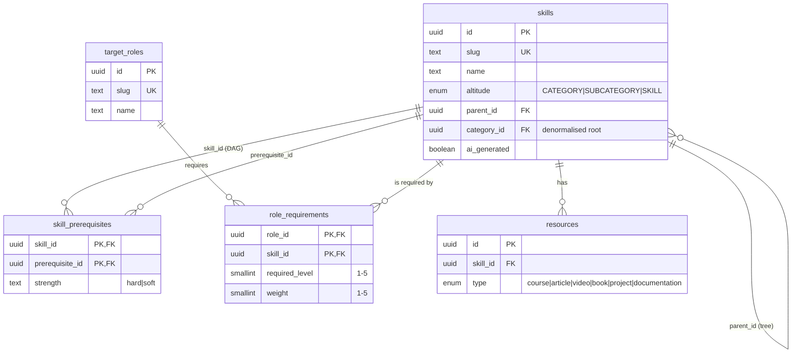
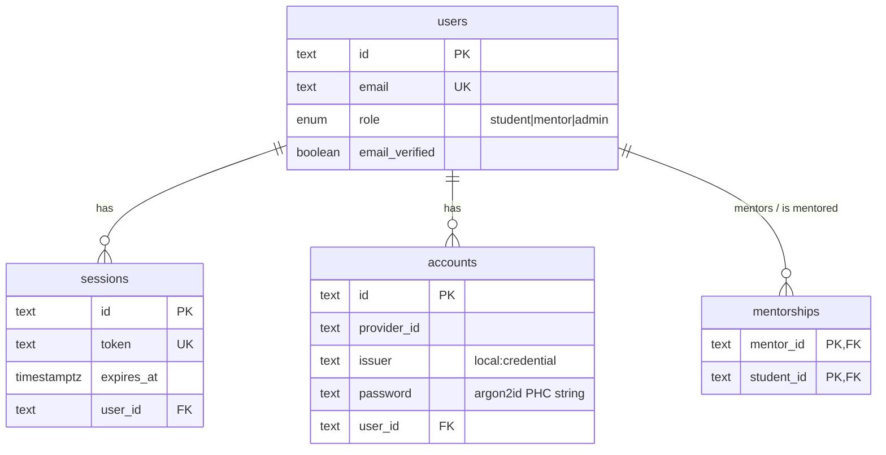
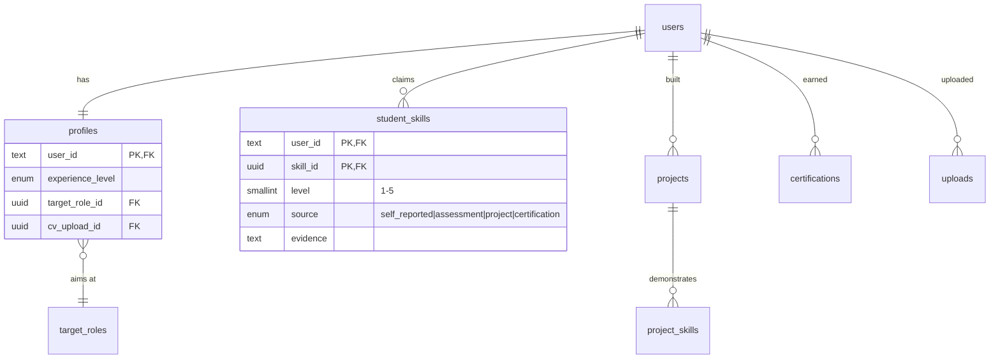
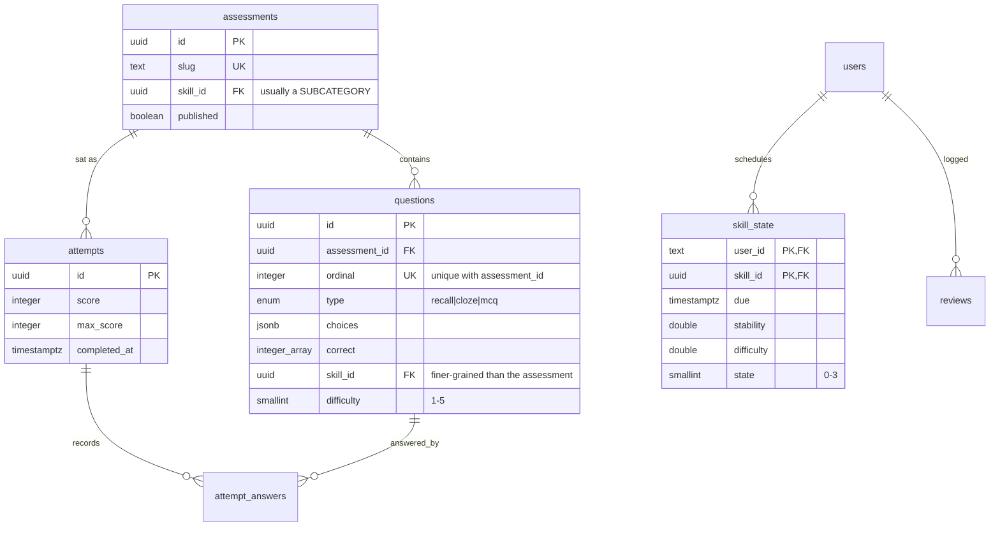
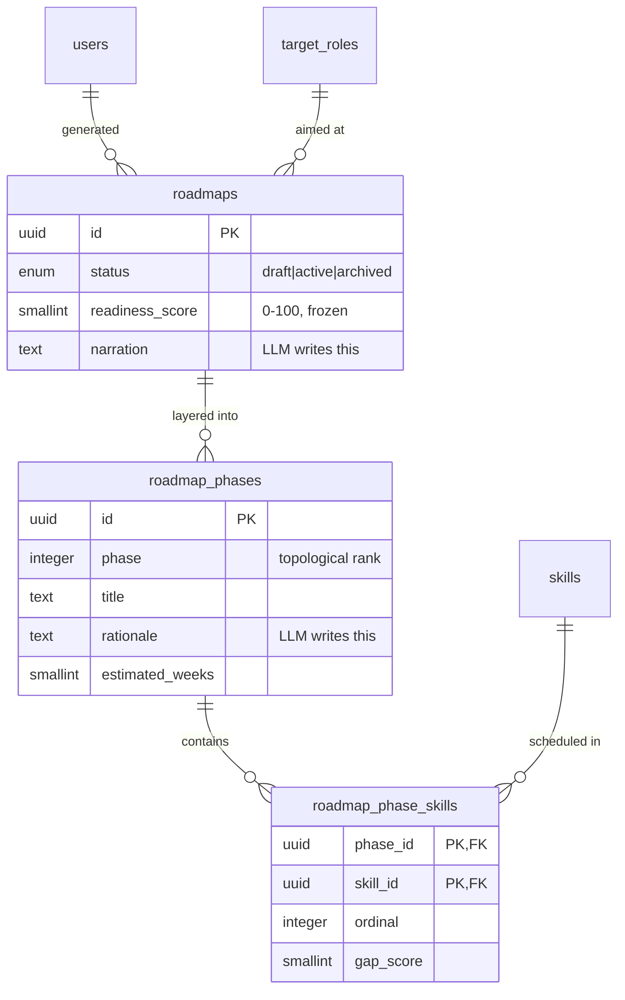

# Database schema

PostgreSQL 17 with pgvector. One database, one migration history in
`packages/db/migrations`, applied by the `migrate` container before any service
starts.

## The shape in one paragraph

`skills` is one table with an `altitude` enum (CATEGORY / SUBCATEGORY / SKILL).
Two structures sit over it: a **tree** via `parent_id` (the Skill Tree view) and
a **DAG** via `skill_prerequisites` (the Skill Graph). The **roadmap is not a
third structure** — it is the target role's required subgraph, minus what the
student has demonstrated, layered by topological sort. Three views, one table.

## Skills and roles

Two invariants cannot be expressed in SQL and are enforced on write, with
`SkillGraph.validate()` in the Python service as the backstop:

- prerequisite edges connect leaves only (`altitude = 'SKILL'`)
- the prerequisite graph stays acyclic

The seed script checks both before it writes, with a depth-first cycle
detector — an undefined topological sort would silently produce a nonsense
roadmap.

`required_level` and `student_skills.level` share the 1–5 scale on purpose:
the gap calculation is a subtraction, and `weight` is what stops every gap
scoring the same.

## Identity

Better Auth's tables, adopted as source rather than regenerated. Four
hand-applied edits are documented in `packages/db/src/schema/auth.ts` and must
survive any regeneration: the `user_role` enum, `withTimezone` on every
timestamp, the `rate_limits` table keeping its `id` column, and `accounts.issuer`.

The password hash lives on `accounts`, never on `users`. `mentorships` exists so
a mentor's read access is a join, not a role-string comparison.

## Student evidence

`source` is why the roadmap can weigh a claim differently from a result. An
assessment overwrites `self_reported` and earlier `assessment` rows and leaves
`project` and `certification` rows untouched.

## Assessment and progress

`questions.skill_id` being finer-grained than `assessments.skill_id` is what
lets one sitting produce a per-skill breakdown instead of a single score.

`skill_state` is FSRS keyed on a **skill**, not a flashcard. Every column is
needed to reconstruct a `ts-fsrs` Card; `state` in particular selects which
scheduling branch runs. Proficiency decays and has to be re-earned.

The `(assessment_id, ordinal)` unique index is the natural key the seed upserts
on, so re-seeding updates a question in place instead of orphaning the attempt
answers that reference it.

## Roadmap

Stored output, not a source of truth. Python computes `phase` and ordering; the
LLM only fills `narration` and `rationale`. `readiness_score` is frozen at
generation rather than computed on read, so regenerating later shows movement
instead of overwriting the evidence of it.

## Making changes

Follow `.claude/skills/db-change/SKILL.md`. Typechecking does not prove a check
constraint is valid SQL — every migration is verified against a real Postgres,
and the constraint is proven to bite by inserting a row that should fail.
